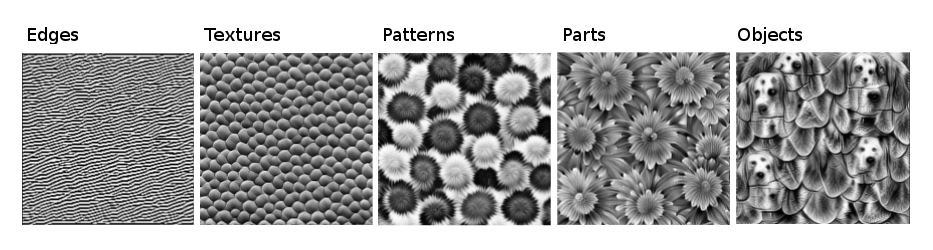

# Deep Learning {#deep-learning}

* In deep learning, the world is modeled using (deep) neural networks.
* The mindset is two-fold:
  * Stacking neural network layers like Lego bricks, shaping the architecture for the task at hand.
  * Standing on the should of giants: Build upon large pretrained networks that embed a lot of knowledge.
* Neural networks based on stacking various layers of neurons.
* A machine learning mindset, orthogonal to [supervised learning](#supervised-ml), [unsupervised learning](#unsupervised-ml) and [reinforcement learning](#reinforcement-learning).

<!-- short story -->
The statistician carefully selected the next variable to include into the model.
Maybe he should use the logarithm of the variable to better capture the relationship with the variable.
The model now had 12 parameters, which should be fine to train.
It was a good day.
Time for a coffee break.
The next room was occupied by another person.
A deep learner.
A butcher, a brute when it comes to modeling data.
He dared look over her shoulder.
He had never seen anything like it before.
The model was a monstrosity.
Millions of parameters.
A horrible mess.
No interpretability, no theory, no guaruantees for convergence.
The deep learner shortly looked up, and quickly said "hi".
The statistician watched in horror as the deep learner kept adding even more layers.

<!-- a tale of failure and success -->
2013.
The first year that I really tried using neural networks.
A most underwhelming experience.
It was a small network with two hidden layers.
The training was slow and the performance was disappointing.
It was for a machine learning class.
From that stand point, neural networks were just another supervised learning tool.
Somewhere between support vector machines and random forests.


Little did I know at the time the transformation that took place.
Deep neural networks had already started to absolutely crush the competition in image recognition tasks like the ImageNet image classification challenge (CITE challenge, CITE AlexNet) [@krizhevsky2012imagenet,@ILSVRC15] or a traffic sign recognition challenge [@cirecsan2011committee].
It's difficult to pinpoint exactly when the deep learning hype rocket took off.
But around 2012 or a few years later seems about right.
A hype that's still strong 10 years later, having not only become a deep learning hype, but an AI hype.
This hype is reflected in the large number of deep learning researchers, an insane amount of money in AI products, and lots of media coverage.  

Welcome to **Deep Learning**!   


## Deep Learning

Deep learning is "simply" neural networks with many layers.


```{r nn, fig.cap = "A neural network with two input features, a first hidden layer with 3 neurons, another hidden layer with 3 neurons and a single output."}
c1 = circleFun()
c2 = circleFun(c(0,5))


layerFun = function(x, ys, diameter = 1){
  circs = lapply(ys, function(y) {
      x = circleFun(center = c(x, y), diameter = 1)
      x$group = sprintf("group%s%s", x, y)
      x
      })
  dat = data.table::rbindlist(circs)
  data.frame(dat)
}

input_layer  = layerFun(0, c(-1, 1))
hidden_layer1 = layerFun(2, c(-2, 0, 2))
hidden_layer2 = layerFun(4, c(-2, 0, 2))
output_layer = layerFun(6, c(0))

segs1 = expand.grid(x = 0, xend = 2, y = c(-1, 1), yend = c(-2, 0, 2)) 
segs2 = expand.grid(x = 2, xend = 4, y = c(-2, 0, 2), yend = c(-2, 0, 2)) 
segs3 = expand.grid(x = 4, xend = 6, y = c(-2, 0, 2), yend = c(0)) 

segs = rbind(segs1, segs2, segs3)

p = ggplot(mapping = aes(x = x, y = y)) +
  geom_segment(data = segs, aes(xend = xend, yend = yend)) +
  coord_fixed() +
  geom_polygon(data = input_layer, aes(group = group), fill = "grey") +
  geom_polygon(data = hidden_layer1, aes(group = group), fill = "grey") +
  geom_polygon(data = hidden_layer2, aes(group = group), fill = "grey") +
  geom_polygon(data = output_layer, aes(group = group), fill = "grey") +
  theme_void() +
  annotate("label", x = 0, y = 3, label = "Input") +
  annotate("label", x = 2, y = 3, label = "Hidden 1") +
  annotate("label", x = 4, y = 3, label = "Hidden 2") +
  annotate("label", x = 6, y = 3, label = "Output") 
add_cc(p)
```

<!-- What is a neural network -->
The input (images, tabular data, ...) is put into the neural network and some output, like a classification score is produced.
The input is transformed multiple times as it passes through the neural network layers.
Each layer enocdes a parameterized mathematical operation.
After each step mathematical operation the data are transformed and "stored" in the neurons. 
So the layer is the combination of the mathematical operation + the new transformed data (with the exception of the input layer).
The atomic unit of a neural network is the neuron, but it's more useful to think of the layers as based units.  [^ann]
The output of one layer serves as the input to the next layer.


<!-- learnable operations -->
The individual operations are parameterized.
For example, in a fully connected layer, all activations from the previous layer are connected to every neuron in the next layer.
Or, if we zoom in on a single neuron of the next layer, it's activation is a weighted some of all activations of the previous layer.
A fully activation layer is usually followed by an activation layer, like ReLU.
ReLU stands for rectified linear unit.
This layer performs a threshold operation that sets negative activations to zero.

<!-- training -->
Neural networks are most commonly trained with backpropagation.
The basic idea is that during training data points are shown.
The error is backpropagated through all the layers of the neural network.
Based on the loss function, the parameters of the neural network are adjusted.

<!-- results from that architecture -->
But why is this type of architecture so interesting?
Why is it more interesting than random forests, or support vector machines?
Let's dig in.
It's two things that make neural networks something special.

<!-- Lego layers -->
Neural networks are organized in layers which are mathematical functions through which a derivative can flow.
These layers can be freely combined with other layers, given that the input and output dimensions match.
Since they all have a derivative, they can be trained together.
This is like a toolbox from which you can pick whatever suits best.
Because all are differentiable, we know that we can train the network anyways.
It also allows for the computations to be organized in a computational graph.
This makes the software engineering part easier and allows a coherent software approach.
But more on this later.

<!-- Embeddings and large models -->
The second part is a most curious property of neural networks: feature representation learning.
Neural networks can learn meaningful representations of the data within its own activations.
For example, convolutional neural networks are used for image classification.
The first layers learn to recognize simple patterns.
The higher layers learn more abstract concepts, like tennis balls or dog ears.
The thing is: the deeper the network, and the more parameters, the more room there is to learn such abstract concepts.
And of course lots and lotsand lots of data.
We are talking images and text data here.
The neural network becomes a vessel for the concepts, patterns and ideas within the data.
Also more on that later.


<!-- a machine learning mindset -->
Deep learning is a machine learning mindset, albeit an imperfect one.
It's a machine learning mindset in the sense that it's hyper focused on performance.
Also concerns such as the data-generating process or interpretability are in the backseat.
By definition you leave the deep learning mindset when you would choose, for example, a random forest if the performance is better.
And there are really people who would use only neural networks to solve modeling problems.
Given that we only use neural networks, the deep learning mindset is a perfect machine learning mindset.
As we care about minimizing the generalization error.
A good deep learner searches various neural network architectures and optimizes hyperparameters such as training rates.

<!-- DL overlaps with other ML mindsets --> 
Deep learning cannot be categorized with the three other machine learning mindsets.
Because deep learning can appear in all three:
Neural networks can be used in a supervised fashion.
They can be used for unsupervised learning.
And they are used in reinforcement learning, called deep reinforcement learning.
And you can do those things while being in the deep learning mindset.


<!-- what mindset are you in ? -->
If you use a deep neural network to forecast crop yields, are you coming from a supervised or a deep learning mindset?  
It depends.
Did you also try out other machine learning approaches, like random forests or support vector machines?
And just ended up with neural networks because they work best?
Or did you choose neural networks because they are known to work well for, for example image classification.
Or were some other constraints for using neural networks?
Like some time constraint, or because your companies backend is already well equipped for neural networks.
In all those cases you are clearly acting from within a supervised learning mindset.
But you might use deep learning because you always do.
Because you are familiar with it.
Because you know exactly how custom build a neural network specifically for that task.
Or you want to leverage a pre-trained network.
The you are clearly working from a deep learning mindset.

<!-- revisiting my neural network experience -->
In 2013, when I tried neural networks for the first time, it was just one of many approaches.
So I clearly was just doing so from a supervised mindset. 
Neural networks -- just another machine learning approach to try.

Let's get a bit deeper into why deep learning is special.

## Stacking Legos

<!-- what is Lego -->
Lego is a construction toy system (not only for kids though).
It consists of individual bricks and pieces that can be put together to construct bigger structures.
Like a castle, a garden, or a space shuttle.
But you can also use the individual parts to build your own stuff.

<!-- deep learning is like Lego -->
Building neural network architecture Deep learning is like a Lego system.
Each layer is a brick, that you can combine with more layers into an architecture of your liking.
Only the dimensions have to match, but otherwise you are free to stack layers.
And it's guaranteed that they are trainable, thanks to all these layers having a derivative.

<!-- modularity makes implementation -->
When a deep neural network is implemented, the software automatically builds up a (directed acyclic) graph of the chained operations.
Given that graph, the deep learning software can automatically compute the gradients for each parameter within that graph.
The last layer's output is used to compute the loss of the model.
Working backwards from that layer the derivative of that loss is computed for every layer.

<!-- layers with different functions -->
Which layers you choose depends on the task, type of input data (image, text, tabular, ...), compute resources, data size, ...
Here is a peak into the available bricks, I mean, layers.

* Fully connected layer. All neurons of the previous layer are connected to all neurons of the next.
* Convolution layer. Turning  image-like input into a "feature-map". Useful for grid-like data, such as images or spatial data. 
* Activation layers such as ReLU. They are needed to prevent the network from just being a neural network. Typically used after most layers.
* LSTM layer. Stands for long short term memory, and useful for sequential data.
* Embedding layer. Turns categorical data into numerical vectors. Useful for quantifying the concepts of the categories regarding their usefulness for the task.
* Region proposal layer. Outputs bounding boxes on images. Used in neural networks for object detection.
* ...

And many, many more.
One of the jobs of deep learning researchers is to invent new types of layers (and show how to use them in some new architecture).

<!-- build your own lego castle -->
Now, if there is some task to do, like, a prediction task, you can custom build you own neural network!
Pick a loss function.
Define the output: class probabilities? 1-dimensional regression? Bounding boxes on images? Image segmentation? The next letter in a sequence? 
Just stack layers    

  - insurance company with digital workflow
  - they want to estimate the damage
  - bicycle insurance
  - customers with insurance claim send in image of broken part
  - and also have to fill out questionnaire
  - insurance wants to use deep learnign to predict how much it will cost
  - input: image of bike. and the survey answers (like initial cost of bike, parts that are broken, ...)
  - they define a custom loss function:
    - for true damages below 100 Euro it does not matter if predicted loss is 20 or 90. as long as its below 100 its fine
    - 100 euro is selbstbehalt, so here they won't pay anyways
    - also some other constraints which they make part of the loss function
    - than they also build a custom neural network
    - they take a standard convolutional neural network to process the image data
    - but they also have the survey data
    - so they use also a fully connected network
    - they combine the networks
    - into one
    - trained with the loss function
    - so the damage prediction can use both information
- this is or at least was a typical approach
- I call it the Lego approach
- Deep learning is very modular
- there are many layers

- this mindset is taking  the advantage of the modularity of deep learning archetictures
- you can mix and combine different layers
- and buy that, allow to use different types of data
- even combine multi-medial data
- you can use the loss function that you want
- and in the end, it can still be trained with the same software
- since everything is differentiable
- and you throw backprobagation at it
- you can use the same software for all of it
- the same hardware
- that's why I call it the lego approach:
- you stack all together
- each type of layer is like a lego piece
- rearranged as needed
- but of course, you can also buy pre-build sets and play with this then

```{r layers, fig.cap = "Deep learning allows to stack layers."}
layerFun = function(x) {rectFun(height = 5, width = 1, center = c(x, 0))}
textFun = function(x, label) {annotate("text", x = x, y = 0, label = label, angle = 90, size = 5)}
segFun = function(x) {annotate("segment", x = x + 0.6, xend = x + 2.4, y = 0, yend = 0, arrow = arrow(), size = 1)}

ggplot(mapping = aes(x = x, y = y)) +
  coord_fixed() +
  theme_void() +
  geom_path(data = layerFun(0)) +
  textFun(0, "Input") +
  segFun(0) +
  geom_path(data = layerFun(3)) +
  textFun(3, "Fully Connected") +
  segFun(3) +
  geom_path(data = layerFun(6)) +
  textFun(6, "Convolution")   +
  segFun(6) +
  geom_path(data = layerFun(9)) +
  textFun(9, "Pooling") +
  segFun(9) +
  geom_path(data = layerFun(12)) +
  textFun(12, "Convolution")  +
  segFun(12) +
  geom_path(data = layerFun(15)) +
  textFun(15, "Pooling")  +
  segFun(15) +
  geom_path(data = layerFun(18)) +
  textFun(18, "Fully Connected") +
  segFun(18) +
  geom_path(data = layerFun(21)) +
  textFun(21, "Soft Max")

```


## Learning On the Shoulders of Giants (Networks)

- the other part of the mindset is a completely different
- instead of building your Legos, ahem layers, from scratch, you start with a big ass network
- a big ass network that is already trained!
- and use the knowledge that is embedded in the neural network to your advantage


<!-- transfer learning -->
- there is something like transfer learning
- take a pre-trained network, and only fine-tune it on the task at hand
- for example, take a general image classifier
- then use it to train a dog versus cat classifier
- why do it? why does it work


<!-- deep representation learning -->
- The concept that allows this is called  deep representation learning
- by training a network to classify images, it learns abstractions in the layers
- for example: individual neurons react to different shapes like diagnosal
- or they react to color
- the higher up we go in the neural network, the more abstract the recognized patterns become
- this can be leveraged for other tasks
- because these same kind of features are useful for other image tasks
- same goes for text and word embeddings
- fine-tuning means to only learn the laster layer weights
- or to initialize the network with the current weights, and then 
- slowly train it

```{r cnn-features, fig.cap = "Features learned by a convolutional neural network (Inception V1) trained on the ImageNet data. The features range from simple features in the lower convolutional layers (left) to more abstract features in the higher convolutional layers (right). Figure from Olah, et al. (2017, CC-BY 4.0) https://distill.pub/2017/feature-visualization/appendix/."}

```


<!-- bigger trend: large (language) models -->
- But there is a new and stronger trend
- train very large networks
- using text, or images or multi-task even
- especially large language models are noteworthy here 
- they only generate text
- which doesn't sound too exiting
- but you can do a lot with it
- mostly as creative tool
- but also to answer questions
- (although there is the bullshit ability)
- TODO: find examples   
- the networks get bigger and bigger
- and can only be trained by large Tech companies that can affort it
- training can cost millions in compute resources
- university labs cannot do it.

<!-- prompt engineering -->
- and these large networks change completely how we model the world
- because if the network is deep and has learned deep feature representations, it contains a lot of embedded knowledge
- and this can be leveraged
- but it's "inside" the network
- and we have to get it out
- let's say you have a "next-word" predictor
- sounds boring
- but is powerful, depending on what the input text is
- if the input text is dialogue, we can complete this dialogue
- but you can also prompt the network to do math question
- or to write a dialogue for novel
- or to summarize paragraphs
- its a matter of writing a good prompt

- you can also prompt text to image networks
- create images, based on a text description
- here it also becomes crucial to write a good prompt

<!-- neural networks  why own mindset -->
* Language Models
  * powerful connector of tasks and concepts
  * the importance of a prompt
  * any knowledge is hidden somewhere in the embeddings
* Vision Models


* Special case of risk-based mindset
* It's own mindset because
  * transfer learning. Especially foundation models.
  * feature learning
  * modularity
  * universe of its own. like only using lego to play.
  * Some people would only use neural network
  * universal function approximator
  * any ml model can be distilled into neural network
* Called deep learning instead of neural networks, because it's about how we learn about the world
* Optimization does not matter really
* especially works for images and text
* prediction-focused
*

<!-- examples of combinations -->
- Combine different models: SM Socrates models: https://arxiv.org/pdf/2204.00598.pdf
- Large language model for robotic navigation: https://sites.google.com/view/lmnav


## Advantages

- Embeddings
- Unified computation frameworks possible
- Big ecosystem
- best approach for modeling image and text data
- gradient based
- gradient based means computational graph

## Limitations

- non-causal
- bullshitter mentality of llms
- expensive to train
- Adversarial attacks
- Overhyped
- Crowded space: Competition and so on
- Biases. Of course also a problem for everything else, but there it's embedded and hidden.
- Requires lots of data to train
- Tree-based methods consistently outperform neural networks on tabular data (cite Gael)

References:

* List of pre-trained models https://huggingface.co/models


[^ann]: In the early days often called artificial neural networks. Still artificial now, but, how wants to write such long words?
