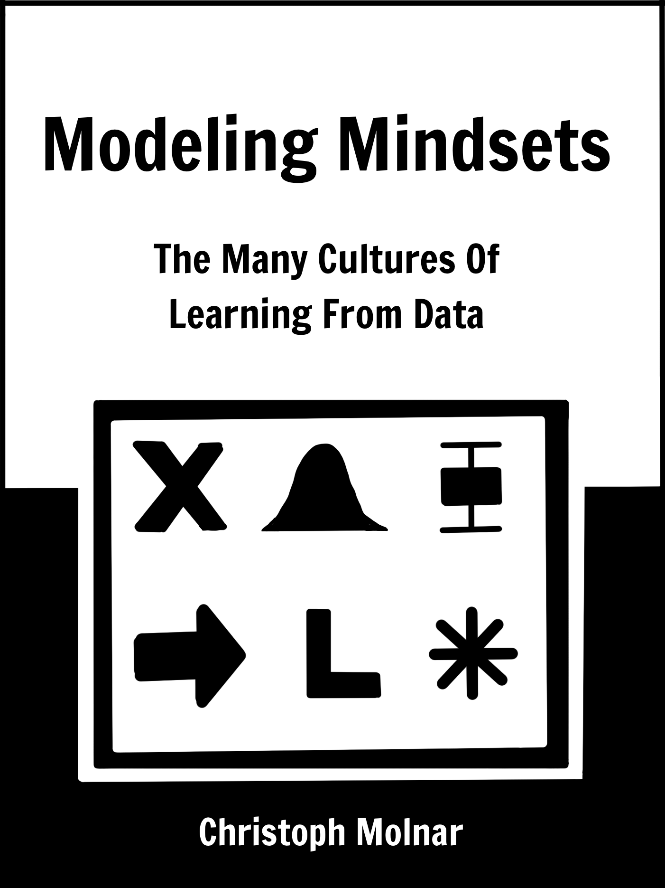

```{r global-knitr, echo=FALSE}
library("knitr")
# Setting global knitr options
output <- opts_knit$get("rmarkdown.pandoc.to")
is.html = !is.null(output) && output == "html"
is.pdf = !is.null(output) && output == "latex"
is.epub = !is.null(output) && output == "epub3" 

opts_chunk$set(
  echo = FALSE,
  out.width = ifelse(is.pdf, "0.8\\textwidth", "\\textwidth"),
  fig.align = "center",
  message = FALSE,
  warning = FALSE,
  fig.path = "images/", 
  collapse = TRUE,
  dev = "CairoPNG",
  dpi = 150, 
  fig.height = 5, 
  fig.width = 7,
  dev.args = list(pointsize = 20),
  fig.path = "figures/"
)


under_construction = "**This chapter is under construction! Stay tuned.**"
```


# Summary {-}

```{r cover, out.width = "400", eval = is.html}

```

<!-- TODO:

Write about how this book is unique:

- usually books/resources are about one mindset
- sometimes only comparing two: stats/ml, freq/bayes, ...
- parts of mindset are implicit in how community works
- lots of reading between the lines
- but this book makes it explicit and saves you years
-->

<!-- Background -->
We use data to advance science, make businesses more profitable, automate annoying tasks, and develop smart products.
But there is a middleman between data and its usefulness: the **model**.
The model represents a simplified aspect of the world; it's the glue that connects data and world.

<!-- Many mindsets available -->
Statistics versus machine learning, frequentist versus Bayesian inference, causation or association, ...
There are many mindsets to consider for building models from data.
Each of these modeling mindsets has its own assumptions, strengths, and limitations.

<!-- best mindset -->
**The best modelers, researchers, and data scientists don't stubbornly stick to just one mindset**.
The best modelers mix and match the mindsets.

<!-- difficulty with learning many mindsets -->
It can take years to truly grasp a new mindset.
Most books and courses jump right into math and methods instead of discussing the fundamental mindset.
But learning a new mindset doesn't have to be this difficult.
<!-- content -->
**The Modeling Mindset book introduces many cultures of learning models from data**.
Each of them enhances your own mind and makes you a better modeler: 

<!-- only list mindsets? without sentence?-->
* Frequentist inference: learning about nature's "true" values.
* Bayesian inference: updating your beliefs about the world.
* Supervised machine learning: predicting new data well.
* Causal inference: taking causality seriously.
* Deep learning: embedding the world into a neural network.
* And many more.

<!-- this book -->
Modeling Mindsets opens the door to all these different ways of thinking.
The book is packed with **intuitive explanations and illustrations**.
Quickly get an overview of the strengths and the limitations of each modeling mindset.
Expand your mind when it comes to modeling the world using data.

